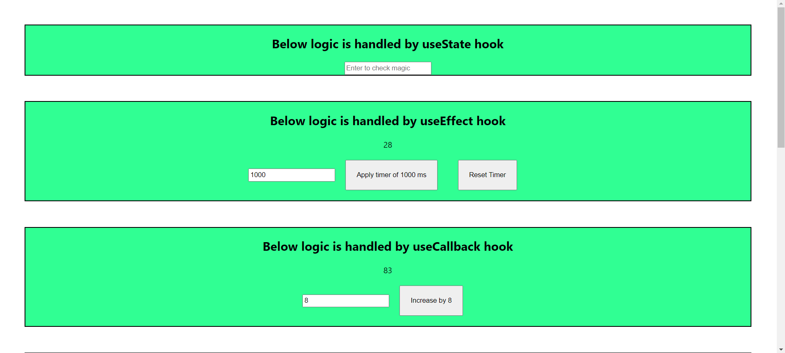
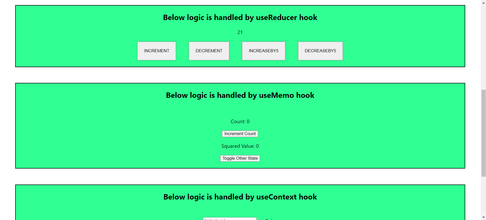
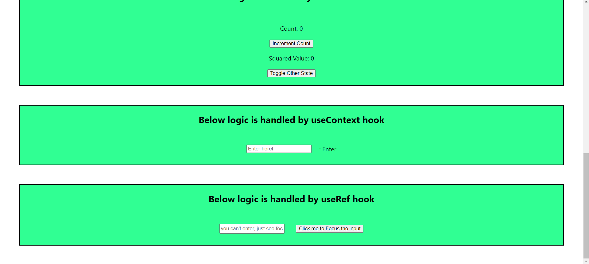

## Available Scripts
This is a hooks practice app, in which you get all major hooks implementation.
In the project directory, you can run:

### `npm start`

Runs the app in the development mode.\
Open [http://localhost:3000](http://localhost:3000) to view it in your browser.

### `npm run build`

Builds the app for production to the `build` folder.\

App screenshots

